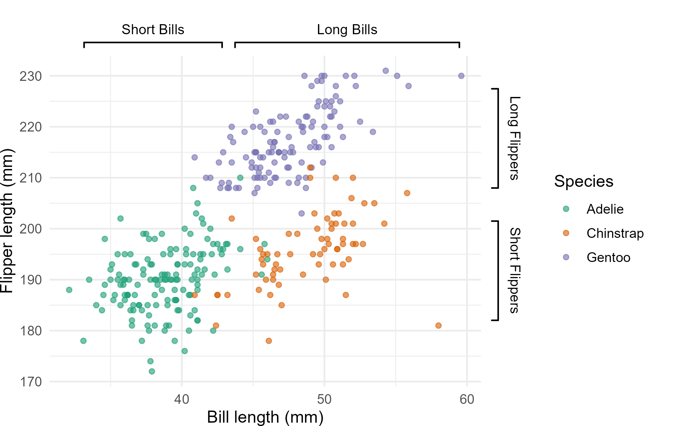
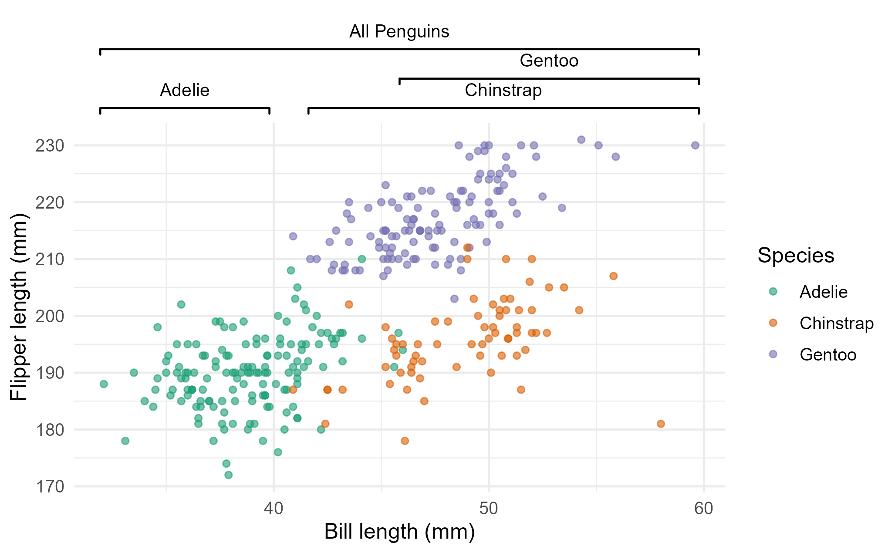
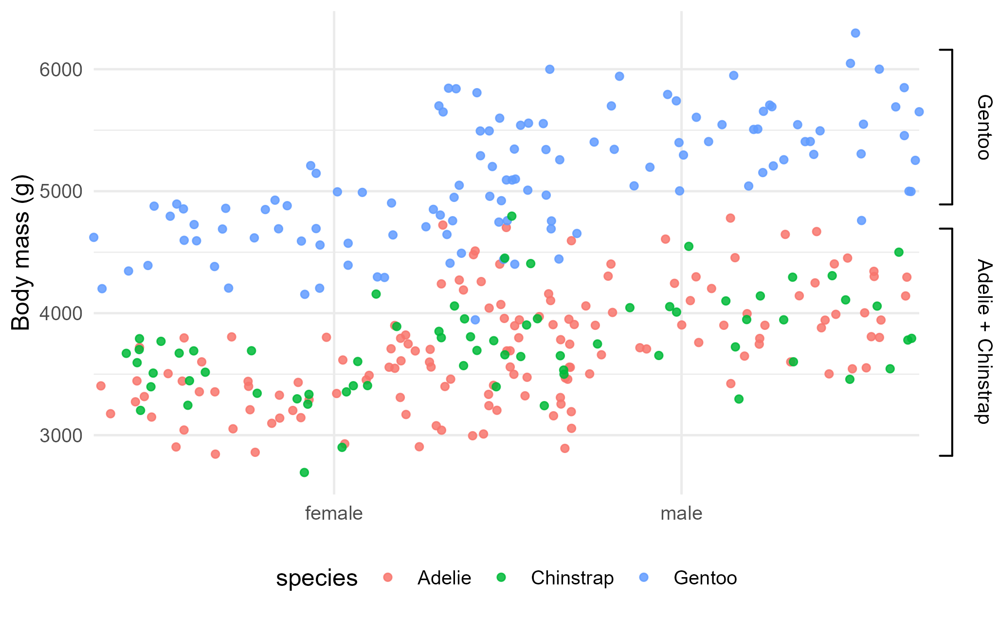
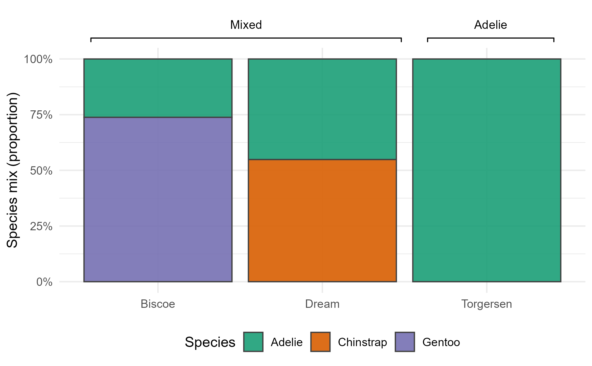

pmplot
Overview
pmplot provides functions for adding clean, publication-ready brackets to ggplot2 plots.

Supports top, bottom, left, and right brackets in normalized panel coordinates (0–1).

Works with facets, multiple brackets per plot, stacked arrangements, and off-panel labels.

Dependencies
The package depends on:

ggplot2

grid

patchwork (for combining plots with shared legends)

Install all dependencies:

r
Copy
install.packages(c("ggplot2", "patchwork", "grid"))

Examples
Penguins demo (pmplot)
This demo uses palmerpenguins to show common bracket patterns: mixed horizontal/vertical, stacked horizontals, facet-like targeting, and a final multi-panel figure.

Coordinates are in panel NPC (0–1). Values outside [0,1] place brackets outside the panel; your helpers auto-expand margins and disable clipping.

P1 — Mixed horizontals + verticals (scatter)
Data: bill length vs flipper length, colored by species

Brackets: two top bands (“Short Bills”, “Long Bills”) + two right bands (“Short Flippers”, “Long Flippers”)

Legend handling: nudged far right via legend.position = c(1.15, 0.5) and a large right plot.margin

Figure: 

Key call:
add_brackets(base_b, specs1, label_offset = 0.04)

P2 — Stacked horizontal brackets (top)
Data: same scatter as P1

Brackets: three species-level bands plus a higher “All Penguins” band, stacked above the panel (increasing y)

Tip: if labels get crowded, increase label_offset, use label_wrap, or add a small stagger in your stack helper

Figure: 

Key call:
add_horizontal_stack(base_b, labels = ..., xstart = ..., xend = ..., y = ..., side = "top")

P3 — Vertical brackets (right) on body mass by sex
Data: body mass (g) by sex (jittered points), colored by species

Brackets: two right ranges (“Adelie + Chinstrap”, “Gentoo”) highlighting y-intervals

Theme: legend at bottom; top margin bumped automatically by helper if needed

Figure: 

Key call:
add_brackets(base_w, specs3, label_offset = 0.04, lwd = 1.3)

P4 — Horizontal brackets (top) on island × species proportions
Data: stacked proportions of species within each island (Biscoe, Dream, Torgersen)

Brackets: two top bands (e.g., “Mixed”, “Adelie”) spanning different x-ranges over the categories

Note: proportions labeled with scales::percent_format()

Figure: 

Key call:
add_brackets(base_i, specs4, label_offset = 0.055, lwd = 1.2)

Final — Patchwork composite (A–D), shared legend for P1+P2
Layout: (p1 + p2) share a single legend (via plot_layout(guides = "collect")), stacked over (p3 | p4)

Tags: panels labeled A–D using plot_annotation(tag_levels = "A", tag_suffix = ")")

Export: A4 @ 300 dpi via ggsave(width = 8.27, height = 11.69, units = "in", dpi = 300)

Figure: 

Key snippet:

r
Copy
p1p2 <- (p1 + p2) + plot_layout(guides = "collect") & theme(legend.position = "right")
final_plot <- (p1p2) / (p3 | p4) + plot_annotation(tag_levels = "A", tag_suffix = ")")
ggsave("final_plot_A4.png", final_plot, width = 8.27, height = 11.69, units = "in", dpi = 300)
