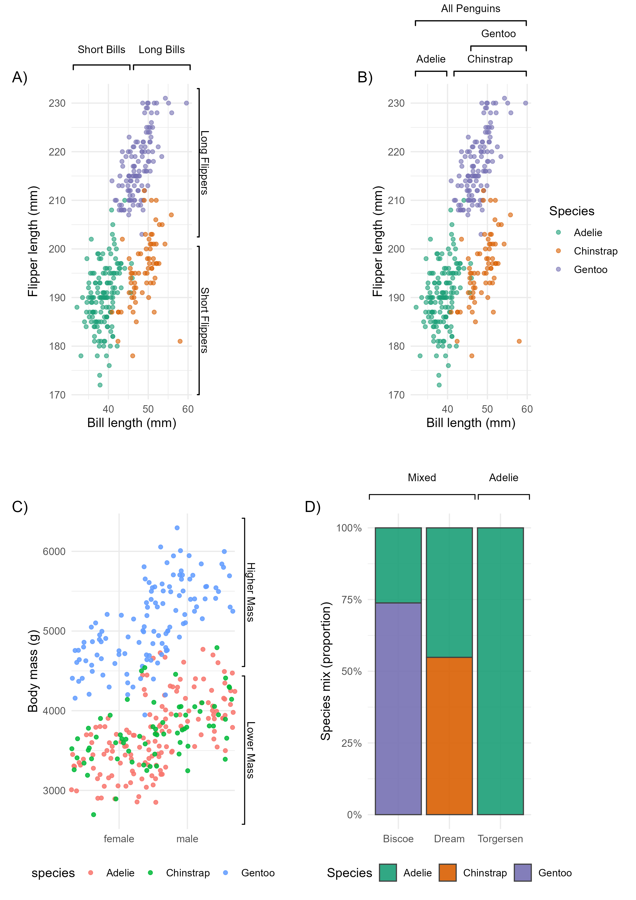

# pmplot

## Overview
**pmplot** provides functions for adding clean, publication-ready brackets to **ggplot2** plots.

- Supports top, bottom, left, and right brackets in normalized panel coordinates (0–1).
- Works with facets, multiple brackets per plot, stacked arrangements, and off-panel labels.
- Default text style: Arial, 10 pt, plain.
## Install and Load
```r
install.packages("remotes")
remotes::install_github("allisonloan/pmplot")
library(pmplot)
```
## Dependencies
- **ggplot2**
- **grid**
- **patchwork** (for multi-panel / shared legends)

Install:
```r
install.packages(c("ggplot2", "patchwork", "grid"))
```
## 🐧 Penguins Demo 🐧 

The **pmplot** package can be demonstrated using the [`palmerpenguins`] dataset.  
These examples show how to add horizontal and vertical brackets in various layouts, handle legends, and combine panels into a final publication-ready figure.
a
### *Final Output — Combined Plots Using Patchwork **  

### **Example 1 — Mixed Horizontals Top + Vertical Right **  
- **Data**: Bill length vs flipper length, colored by species.  
- **Brackets**:  
  - Two top bands: "Short Bills", "Long Bills"  
  - Two right bands: "Short Flippers", "Long Flippers"  
- **Legend**: Nudged far right
```r
p1 <- add_by_groups(
  p1,
  side    = "right",
  labels  = c("Short Flippers", "Long Flippers"),
  n_groups = 2,
  g_start = c(1, 2),       # lower half, upper half
  g_end   = c(1, 2),
  pos     = 1.06,          # nudge to the right of panel
  pad     = 0.03,
  label_offset = 0.05
)

# Nudge legend far right so it won’t overlap brackets
p1 <- p1 + theme(
  legend.position = c(1.15, 0.5),
  legend.justification = c("left", "center"),
  plot.margin = margin(t = 40, r = 150, b = 0, l = 0)
)
```


### **Example 2 — Stacked Horizontal Top**  
- **Data**: Bill length vs flipper length, colored by species.  
- **Brackets**:  
     - Three species-level bands plus a higher “All Penguins” band, stacked above the panel (increasing y) 

```r
p2 <- add_brackets_simple(
  base_b,
  side  = "top",
  start = c(0.04, 0.36, 0.50, 0.04),   # manual NPC coords
  end   = c(0.30, 0.96, 0.96, 0.96),
  pos   = c(1.04, 1.04, 1.12, 1.20),   # vertical position
  label = c("Adelie", "Chinstrap", "Gentoo", "All Penguins"),
  label_offset = 0.05
)
```


### **Example 3 — Verticle Right**  
- **Data**: body mass (g) by sex (jittered points), colored by species  
- **Brackets**:  
     - Two right ranges (“Adelie + Chinstrap”, “Gentoo”) highlighting y-intervalsband, stacked above the panel (increasing y) 

```r
p3 <- add_by_groups(
  base_w,
  side    = "right",
  labels  = c("Lower Mass", "Higher Mass"),
  n_groups = 2,
  g_start = c(1, 2),
  g_end   = c(1, 2),
  pos     = 1.06,
  pad     = 0.03,
  label_offset = 0.04,
  lwd = 1.3
)

```

### **Example 4 — Horizontal Top**  
- **Data**: Stacked proportions of species within each island 
- **Brackets**:  
     - Two top bands (e.g., “Mixed”, “Adelie”) spanning different x-ranges over the categories

```r
p4 <- add_by_groups(
  base_i,
  side    = "top",
  labels  = c("Mixed", "Adelie"),
  n_groups = 3,
  g_start = c(1, 3),       # groups 1..2, and 3..3
  g_end   = c(2, 3),
  pos     = 1.06,
  pad     = 0.03,
  label_offset = 0.055,
  lwd = 1.2
)
```


### **Example 5 — Using this for significance plotting**  
- **Brackets**:  
     - Two horizontal top bands (e.g., “**”, “All groups”) spanning different x-ranges over the categories

```r

p5 <- add_brackets_simple(
  p, side = "top", coord = "data",
  labels = c("**", "All groups"),
  start  = c(1.0, 0.5),
  end    = c(2.0, 3.5),
  pos    = c(8.2, 10),
  label_offset = c(0.03, 0.04),
  label_size   = c(10, 14),
  fontface     = c("bold", "plain")) 

```

