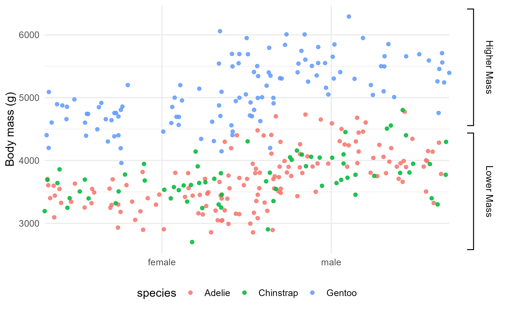
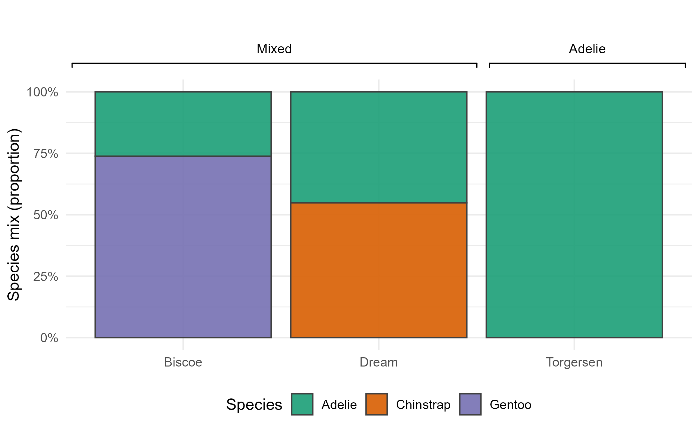

# pmplot

## Overview
**pmplot** provides functions for adding clean, publication-ready brackets to **ggplot2** plots.

- Supports top, bottom, left, and right brackets in normalized panel coordinates (0–1).
- Works with facets, multiple brackets per plot, stacked arrangements, and off-panel labels.
- Default text style: Arial, 10 pt, plain.
## Install and Load
```r
install.packages("remotes")
remotes::install_github("allisonloan/pmplot")
library(pmplot)
```
## Dependencies
- **ggplot2**
- **grid**
- **patchwork** (for multi-panel / shared legends)

Install:
```r
install.packages(c("ggplot2", "patchwork", "grid"))
```
## 🐧 Penguins Demo 🐧 

The **pmplot** package can be demonstrated using the [`palmerpenguins`] dataset.  
These examples show how to add horizontal and vertical brackets in various layouts, handle legends, and combine panels into a final publication-ready figure.
a
### *Final Output — Combined Plots Using Patchwork **  

### **Example 1 — Mixed Horizontals Top + Vertical Right **  
- **Data**: Bill length vs flipper length, colored by species.  
- **Brackets**:  
  - Two top bands: "Short Bills", "Long Bills"  
  - Two right bands: "Short Flippers", "Long Flippers"  
- **Legend**: Nudged far right
```r
specs1 <- data.frame(
  side  = c("top","top", "right","right"),
  start = c(0.08, 0.43, 0.20, 0.60),
  end   = c(0.4, 0.95, 0.50, 0.90),
  pos   = c(1.04, 1.04, 1.04, 1.04),
  label = c("Short Bills", "Long Bills", "Short Flippers", "Long Flippers")
)
p1 <- add_brackets(base_b, specs1)
p1 + theme(
  legend.position = c(1.15, 0.5),
  legend.justification = c("left", "center"), 
  plot.margin = margin(t = 40, r = 150, b = 0, l = 0)
)
```


### **Example 2 — Stacked Horizontal Top**  
- **Data**: Bill length vs flipper length, colored by species.  
- **Brackets**:  
     - Three species-level bands plus a higher “All Penguins” band, stacked above the panel (increasing y) 

```r
p2 <- add_horizontal_stack(
  base_b,
  labels = c("Adelie", "Chinstrap", "Gentoo", "All Penguins"),
  xstart = c(0.04, 0.36, 0.5, 0.04),
  xend   = c(0.30, 0.96, 0.96, 0.96),
  y      = c(1.04, 1.04, 1.12, 1.2),     # stacked outside
  side   = "top",
  label_offset = 0.05
)
```


### **Example 3 — Verticle Right**  
- **Data**: body mass (g) by sex (jittered points), colored by species  
- **Brackets**:  
     - Two right ranges (“Adelie + Chinstrap”, “Gentoo”) highlighting y-intervalsband, stacked above the panel (increasing y) 

```r
specs3 <- rbind(
  data.frame(side="right", start=0.08, end=0.55, pos=1.04, label="Adelie + Chinstrap"),
  data.frame(side="right", start=0.6, end=0.92, pos=1.04, label="Gentoo")
)
p3 <- add_brackets(base_w, specs3, label_offset = 0.04, lwd = 1.3)
```

### **Example 4 — Horizontal Top**  
- **Data**: Stacked proportions of species within each island 
- **Brackets**:  
     - Two top bands (e.g., “Mixed”, “Adelie”) spanning different x-ranges over the categories

```r
specs4 <- rbind(
  data.frame(side = "top",   start = 0.06, end = 0.65, pos = 1.04, label = "Mixed"),
  data.frame(side = "top",   start = 0.7, end = 0.94, pos = 1.04, label = "Adelie")
)

p4 <- add_brackets(base_i, specs4, label_offset = 0.055, lwd = 1.2, cex = 0.9) 
```

